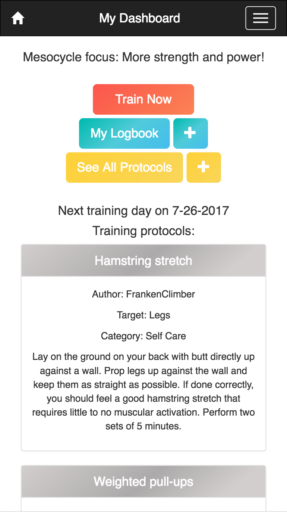
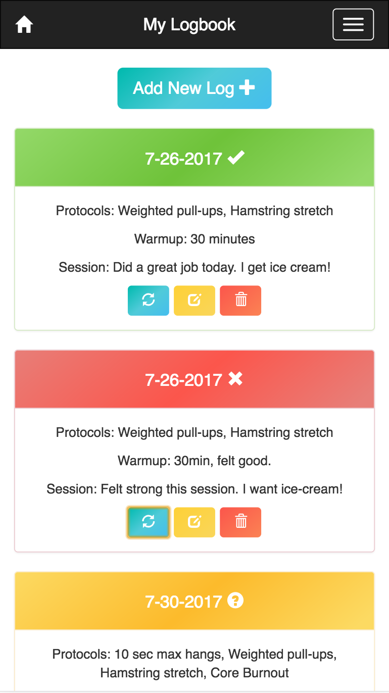

# Boardroom

Boardroom is a climbing training logbook app built with React. It allows the user to save their logs online and identify the training that's helping the user accomplish their climbing goals.

This repository is for the front-end only. The back-end repository can be found here:

https://github.com/Baatzy/g48-capstone-backend

### Screenshots

##### Dashboard view

##### Logbook view

### Installation
The repository can be downloaded and run as a web application for development/testing:

1. Fork and clone.
2. `yarn install` or `npm install` to download dependencies.
3. `yarn start` or `npm start` runs the app.

### Technologies:
* React
* React-Bootstrap
* Express
* node.js
* PostgresQL
* Knex

### API Back-end
Back-end repository can be found at:

https://github.com/Baatzy/g48-capstone-backend

### Upcoming features
* Port to React-Native
* Move state to a manager like Redux
* Add Auth
* Add sorting and filtering for protocols
* Add charts/visualization for logbook data
* Add social element with friend lists and voting on training protocols

##### Built August 2017 for the Galvanize g48 capstone
Stefan Baatz - https://github.com/Baatzy
